This is mainly adapted from [this](https://cp4space.hatsya.com/2013/04/03/circuitry-in-3d-chess/) series of posts, which outline much of the construction but leave some details unstated. 
I am just filling in the gaps.

Any 3d visualisations here that aren't minecraft are from that post. 

# Rules 
- Rooks move any number of spaces in a single axis.
- Kings move 1 space in any direction including triagonally 
- White pawns move upwards (increasing z coordinate) and black pawns move downwards; pawns capture in diagonals that go in thair movement direction plus one space horizontally. (you could allow triagonals and it's probably possible though some setups would need to be altered, mainly the king cage)
- Knights move 2 spaces in one axis and 1 space in another.
- Bishops move diagonally, i.e. along 2 axes. (you could also allow triagonal movements)
- Queens aren't needed. 

[This](https://cp4space.hatsya.com/2013/03/30/three-dimensional-chess/) post has visualisations.

As stated in [the common definitions](/common-defs.md) page, capturing any king = win, and there's no castling, promotion, pawn doublemoves, en passant, or stalemate. (you could allow any of these things besides promotion to be possible in the ruleset of the game but they won't come up in this TC proof) 

We are considering positions with only a finite number of pieces.

# Components 
Basic components mostly from [this](https://cp4space.hatsya.com/2013/04/03/circuitry-in-3d-chess/) post. 

## King cage: 
Traps 2 opposing kings.
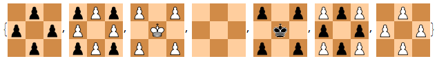

## Rook cage: 
Most important component. Traps several rooks mutually pinning each other to trapped kings. 
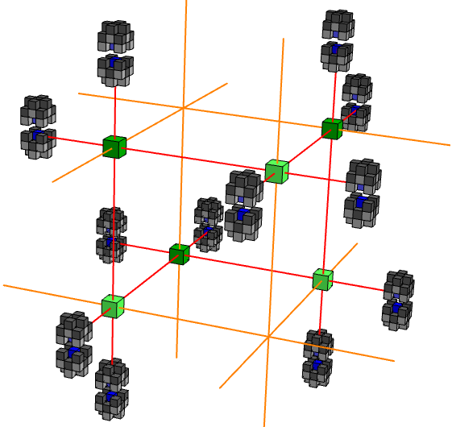

Can be considered as two *virtual rooks*, one of each colour, at the triple intersections of each line. 
They can deliver checks to kings, but not move otherwise. Unwanted lines of attack can be blocked by pawns. 

Importantly, virtual rooks are arbitrarily tileable (so you can have them covering several adjacent lines). There's a lot of flexibility in layout, the cages and physical rooks can be wherever needed to not get in the way of anything else.

They can also be *defended*, by defending the physical rooks part of them with a pawn (blocked by an opposing pawn) that leads to a discovered checkmate if it's allowed to capture. 
(Assume that any pawn that's defending some point anywhere in this setup is "strongly defending" it in this way - if it's allowed to capture, it wins).

We can typically assume any virtual rook to be strongly defended this way when relevant.

## Constrained rook
A virtual rook can pin an opposing rook to a king. Then the opposing rook can move freely within a line, but can't move outside of it. 

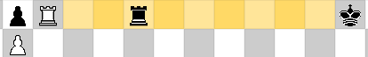  
In this case, the white rook is virtual, the king is trapped in a king cage, and so the black rook is constrained to only be movable along the yellow region.

We can ensure that only a few positions are useful for it to be in by using pawn walls to block unwanted attacks from other positions.

A variant on the idea is to have two opposing rooks pinning each other and threatening to capture each other delivering a checkmate. They can then only safely stand on positions (strongly) defended by a pawn:

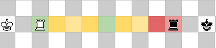
In this case, imagine that behind the green squares is a pair of pawn for whcih the white one is definding that square, and likewise for red squares and black pawns. Then the only safe spaces for the rooks to move to are the defended spaces, otherwise the other rook captures it and checkmates.

I believe this variant is not strictly necessary for the setup. 

Bishops can also be constrained in the same ways. A virtual bishop is just a bishop pinned by a virtual rook, which can then constrain opposing bishops to a diagonal. 

## Corridors
Primary operation of the machine will be driven by white moving kings through corridors to interact with components. 

Corridors constrain the king's movement to a single channel.

The original blog post contained physical corridors made of pawn walls, but virtual rooks can also constrain the king remotely in most cases, and are easier for me to visualise and think about. Physical corridors may be practical if you were trying to write a program to actually construct a full position from a given turing machine, but i'm a mathematician i'm just proving existence here. 

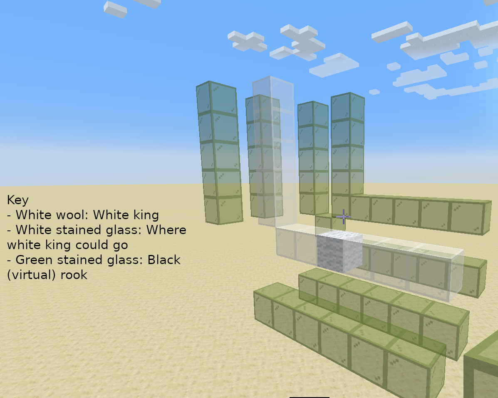 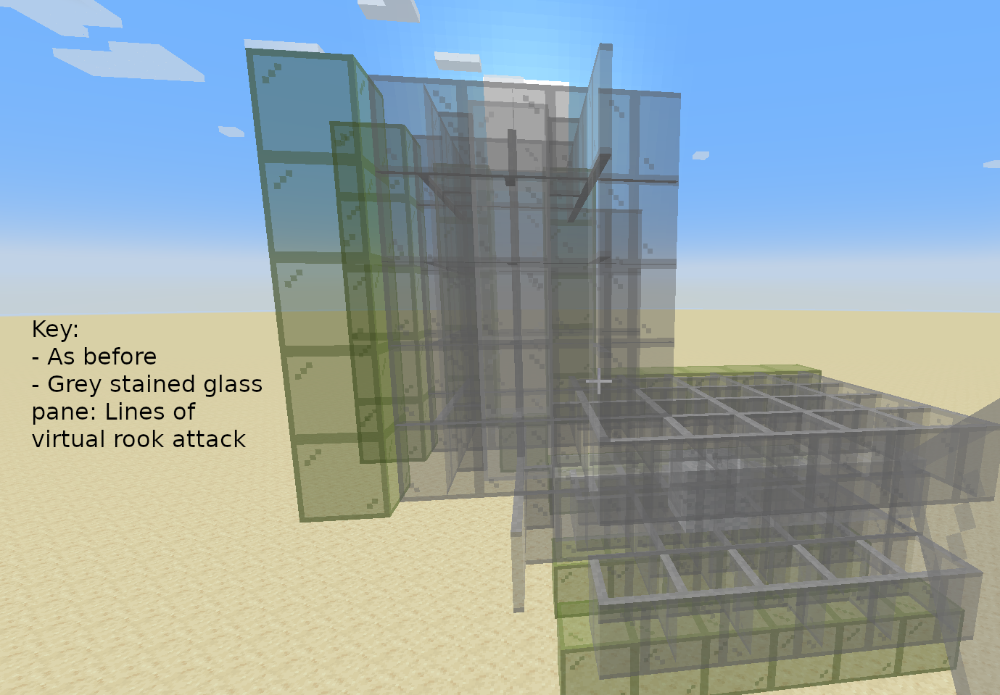
Visualisation - Top shows the path white's king can go, bottom shows a very messy view of the relevant lines in which the virtual rooks attack. 

## Diodes and transistors
A transistor is a black rook along a corridor that's able to be threatened by a king, and must move out of the way for it. (constrained along one axis of movement to do so). 

This frees up space in another corridor for another king to be able to move. 
It's a diode when this threat can only be made from one direction, preventing the king from moving backwards.

For example:

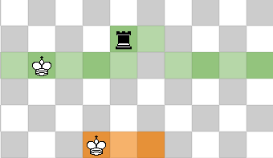

In this image, kings are constrained to their coloured regions with virtual rooks covering each space outside of them. 
When the king in the green region moves from the left, threatening the rook. The rook is constrained along the axis perpendicular to the image, and must move out of the way along it. This allows the king in the orange region to move through it. 
A king moving through the green region from the right however is unable to get past the rook.  
Thus this is a diode and a transistor. 

Using diodes and transistors, it's possible to construct arbitrary logic gates and latches, with corridors as wires to connect them. 

This can also store state - Say we have some black-box component with one entrance and several exits. 
We can have a "primary king" able to enter the component from one of several places, and along the way opens some transistors allowing auxiliary kings to "remember" which state it came from. 
When the primary king exits the component, then a series of logic gates can be used to decide based on which exit it came from and where it started, where it should go next; and then "reset" to allow all the auxiliary kings to travel back to their starting position.

## Counter - Overview
We aim to construct a *[Minsky machine](https://esolangs.org/wiki/Minsky_machine)* - a Turing Complete system consisting of 2 or more *counters*, which can hold arbitrary natural numbers, and several *states*. 
In each state, we either increment a counter and go to a different state, or we decrement a counter, (and have undefined behaviour if it was 0; machines can always be constructed such that this never happens), or we can zero-test a counter and go to one of 2 stated depending on whether it's 0.

With the back-box component above being a counter, with 3 entrances (increment and decrement) and 3 exits (inc/dec complete, zero-test is zero, zero-test is nonzero); the above process with remembering the prior state is exactly the logic needed to decide the operation of a Minsky machine. 

Within the counter itself, there wil be several sub-components that should be traversed in a particular order for an increment or decrement operation, which the same idea can be used to manage, 

The counter is the most involved part of the construction. 

The principle is a "sliding king memory" - As described in [this](https://cp4space.hatsya.com/2013/04/05/3d-chess-is-turing-complete/) post, the back king will be constrained to a helix pattern. 

White then has a king on a ring below the helix, for which there white are virtual rooks attacking upwards, providing just one safe space for the black king, above the white king.
During an increment operation, thw white king wil be able to move anticlockwise around the ring, forcing the black king to climb up the helix, and for decrements white moves clockwise. 

In the original blog post, there are knights constrained to a pair of columns, but the description they give is not something i was able to cleanly make work. There is also no description of the controlling ring. I aim to address these points. 

## Rook column
This setup allows a white rook to be constrained to a single column, but its height is unbounded. It is pinned to a white king, but the king can move upwards. 
A wall of pawns can move upwards with it to shield it from any rogue checks. 

A square of black virtual rooks below constrain the king to a column, with the central one providing the pin being (strongly) defended.

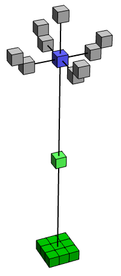

## Helix 
Suppose for a moment we have a way to constrain the movement of a black knight or bishop, such that:
- It can only rest in one column 
- Its height modulo 4 cannot change

(in older setups, this was a knight; but it can be a bishop instead).
This is part of how we constrain black's king to a square helix pattern, as shown:

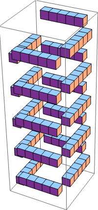

There are white rooks covering all the vertical columns outside of the helix.
Then, consider each cross-section of the edges of the helix. 

There's a line that's part of the helix where the black king is supposed to be allowed to occupy. White rooks in rook columns cover the rows above and below the helix arm, whereas a black bishop occupies the row of the helix arm itself, defending it from any possible rook attacks. 
(the original block post uses 4 rook columns per arm, but I think only 2 are needed)

As the bishop is able to move in its column modulo 4, the pattern of possible allowed lines for this plane repeats every 4 rows. 
Putting 4 of these together at offset rows creates the full helix extending infinitely upwards.

At any given time, the white rooks and black bishops only cover a finite subsection of the helix, where the king currently is or could be. We provide enough bishop towers and rook columns for that to be 5 arms, 2 of which are in the resting plane (where the kings are when no counter operations are occurring).

During an increment or decrement operation, white will move their rooks and black will be given an opportunity to move their bishops to cover the new arms of the helix where the black king will be expected to end up when it climbs up or down.  

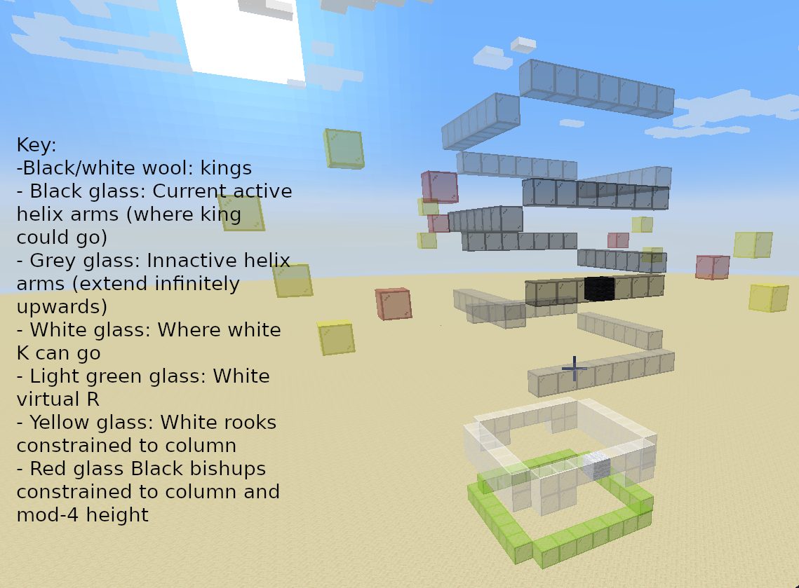 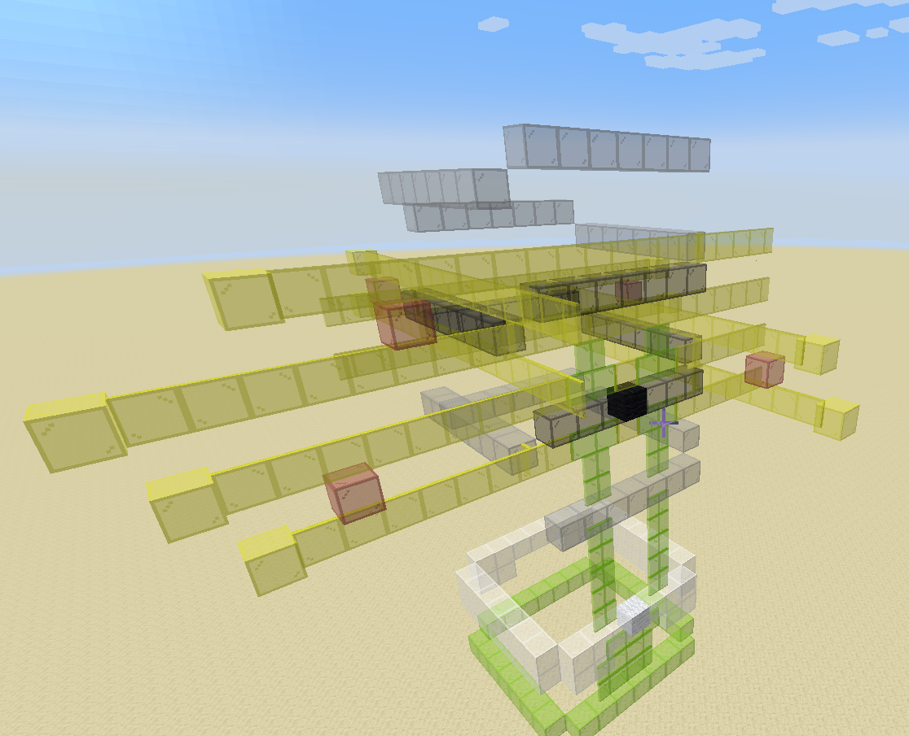
Top shows the helix, bottom also shows relevant attacking lines constraining the black king.

## Bishop column
Here is a 2D cross-section of the bishop column. 
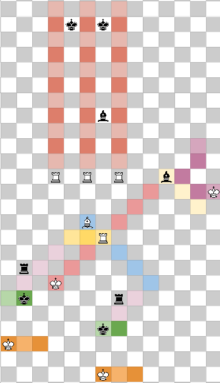

The rooks in the red columns, as well as black's rook, are actually virtual rooks.

Most of the time, the white rook in the yellow region is pinned to the red diagonal.

This rook is pinning black's bishop in the column to the king above. The kings at the top can move arbitrarily far upwards, and can do so faster than white's rook columns can extend their ceiling, so are not threatened by them. 
The kings are constrained to their column, constrained by virtual rooks (the red columns), 3 of which are shown in this cross section. There would be 13 in total.

Now, during an "adjustment" operation, white first moves a king to the purple squares near the pinning bishop, forcing it to move along the yellow diagonal.
This acts as a transistor. 
This unpins the white rook, enabling it to move along the yellow squares in its row. It wants to do so in order to unblock the white bishop, allowing it to move along the blue diagonal to force a king to block a black rook (the black kings in green regions are constrained to it by virtual rooks), opening a transistor allowing a king to move along the orange squares. 

When the rook moves to allow this, it can move to the other column with a king, checking it. This forces the black bishop to move to that column, choosing to move either 2 spaces up or down. 

Then, we can require the king on the purple squares to move away, to open another transistor - forcing the white rook back to its starting position - and then require a king move through the other set of orange squares, ensuring that the bishop on the blue diagonal must also have moved back to its start first. This action enforces the black bishop to move back to its starting column, which can then be at a height of +/- 4 from where it started, or back in the same spot. 

Thus, we have constrained the bishop to a single column with a constrained height modulo 4. 

In summary, we use circuitry to require white kings be in the following sections in the following order:
- Purple
- Lower orange
- Away from purple 
- Upper orange 

At the bottom of the tower, we can enforce a minimum possible height for the bishop, by having it block a black rook if it gets too low, that would normally be preventing white from delivering a checkmate.

An older setup constructed a knight tower. Detailed in [this](./knight-column.md) appendix.

A subtlety to consider is that the black bishop in the tower could be causing checks along infinitely many diagonals. We can be careful to shield any components with white kings from these checks using pawn walls where needed. (besides the rook columns, which can have kings at arbitrary height, but have a built-in pawn fortress for defense, other white kings have a bounded possible path.)

## Controlling ring
The final part of the counter is the controlling ring, which sits below the helix.

There are virtual rooks below every spot in the ring, and a white king on the ring that blocks one of them. The black king on the helix thus must remain above the white king.

The ring is 2 spaces tall, though that's an artifact of an old design and it can probably be 1 space tall. Normally, the white king is constrained to one position of the ring. 
Call the king on the ring A. 

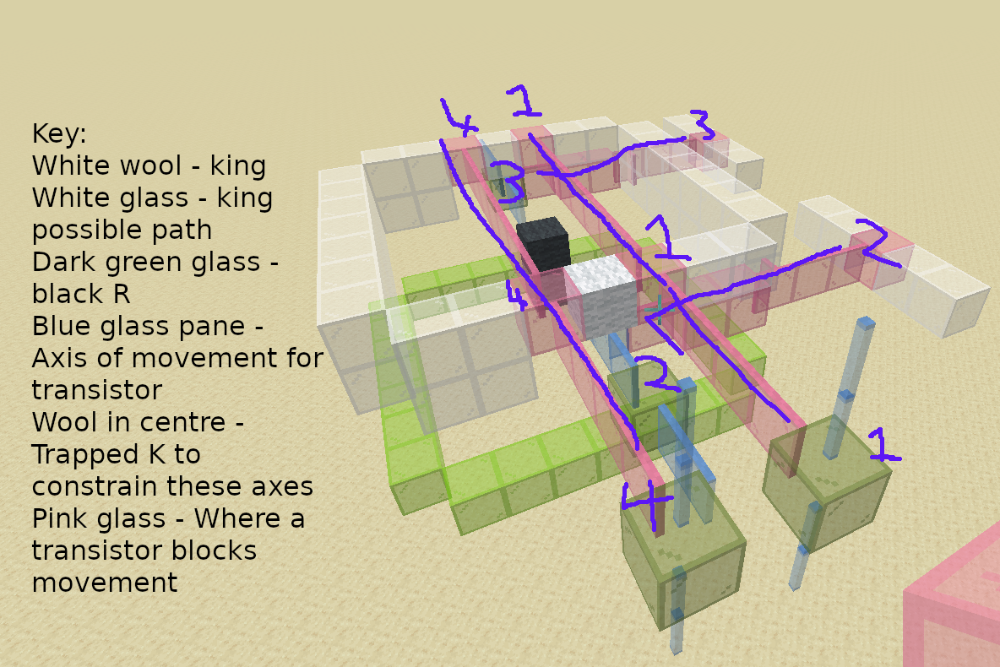

During an increment operation, an external king B comes through. First it traverses each of the bishop towers (*except* the one corresponding to the arm the black king is *currently* in, as that would cause issues. An auxiliary king keeps track of the state of which one that is), performing its adjustment operation allowing black an opportunity to move their bishops to prepare for opening the parts of the helix necessary to climb for the increment. Then, transistor (1) is opened allowing A to move anticlockwise around the ring. When it reaches opposite its starting position, it opens transistor (2), enabling B to move to (3), and allowing A to traverse around the other half of the ring. Finally, it returns to its starting position opening transistor (4) (which is normally open) to allow B out.
Auxiliary kings are used to keep track of internal state ensuring this all happens in the correct order. 
Decrementing is the same thing in a different order. 

## Zero test
At the bottom of the helix, the lowest position the black king will sit bis adjacent to a corridor that white wants to traverse, blocking access. It also blocks a black rook that normally prevents access to a different corridor. Thus which of these corridors white is able to traverse is a zero test. 

It is undefined behavior for a Minsky machine to decrement a counter below zero, and they can be constructed such that this will never happen. So we don't need to consider how to handle such a case in the construction.

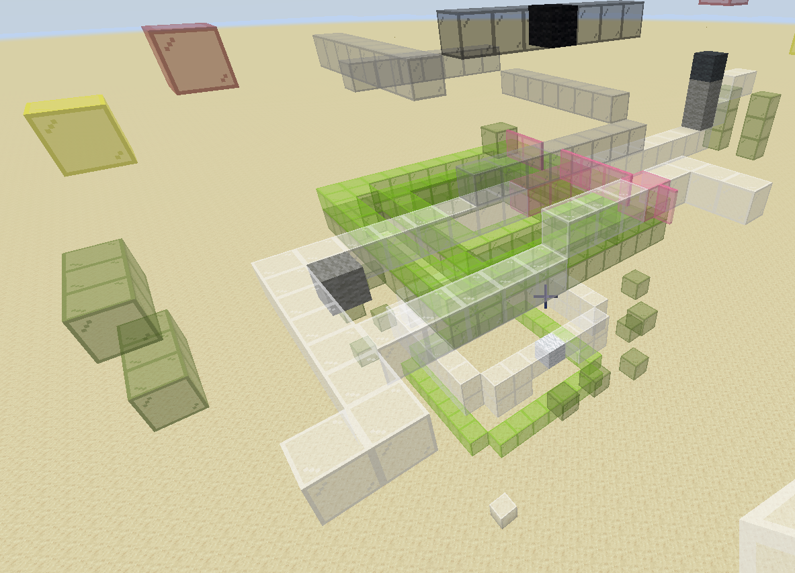
This image shows the zero-test lines, as well as the relative positions of the virtual rooks to constrain black's helix movement from below and white's ring movement from above.
The grey wool blocks are pawns, one of which is pinned offscreen, as a minute detail to route the zero-test lines around the required vertical virtual rooks.

## Conclusion
Putting all of this together, we have counters of that support operations of increment, decrement, and zero test, and can hold unbounded nonnegative integers. 
Attaching all of these to a system of circuitry for a state machine is a construction of a Minsky machine, which if it has 2 or more counters is Turing Complete. 
We can model halting simply as a state where white has a forced win. 

Thus we satisfy our strong notion of Turing Completeness as defined in [the common definitions](/common-defs.md) page - for a Turing machine M, we construct a position and a strategy for white (just follow the steps of the computation), for which if M halts its a winning strategy that has an upper bound in the number of steps it takes to win, whereas if M doesn't halt then there is no winning strategy. 
3D chess with finitely many pieces and multiple kings is Turing Complete. 

Knights aren't needed in the setup, though an alternative setup with knight towers instead of bishop towers needs no bishops instead.

## Unresolved questions
I repeat the unanswered questions presented in the original blog post, with some of my own commentary

- Is 3D chess TC with different subsets of pieces? It's possible with KRPB and KRPN.
- Is 3D chess TC when each side has only one king? That makes constraining piece movement harder. Perhaps soft-pins can be used that threaten allowing a piece (such as a queen) to escape and go cause a checkmate.
- Is 2D chess TC? With finitely many pieces, I don't know. For regular positions that can repeat patterns infinitely in certain ways, I attempt a proof [here](/2d-reg-oneking/main.md). There ae some potential ideas for constructing a similar setup to this with finite pieces, in particular to create counters by constraining a black king to a zigzag pattern using bishops.
- Can anything be done with the notion of having infinitely many choices? This is used to construct "mate-in-omega" positions, where white has a win but not in any finite number of moves. In theory, this could be used to prove a stronger statement than turing completeness, namely that every statement in first-order Peano arithmetic can be encoded as a 3D chess position. The original blog conjectures that this is true, but is tricky. It easy to inject finite choices for either side into the state machine (white can choose to go down one of two paths, or black can choose to block white's access to one of two paths), allowing an *Alternating Turing Machine* to be constructed, but this doesn't translate to an infinite choice (say you can allow black to keep incrementing a counter until they choose to stop. They could just never choose to stop, so this doesn't translate to "choosing an arbitrary integer"). 
But, say if black was able to move a rook arbitrarily far upwards at the start of the game. If white could get a rook above black's, pinning it, and somehow these rooks were prevented from capturing each other (say this is done twice and the rooks involved now defend each other?), then white's rook could constrain the maximum height of a counter down to black's original choice. With the above mentioned finite black choice state they can increment this counter up to their original choice but not higher or else they lose. This would thus encode black choosing a true arbitrary natural number. 
However, sufficiently constraining this setup to not break the rest of the system and allow the rooks complete freedom seems tricky. 