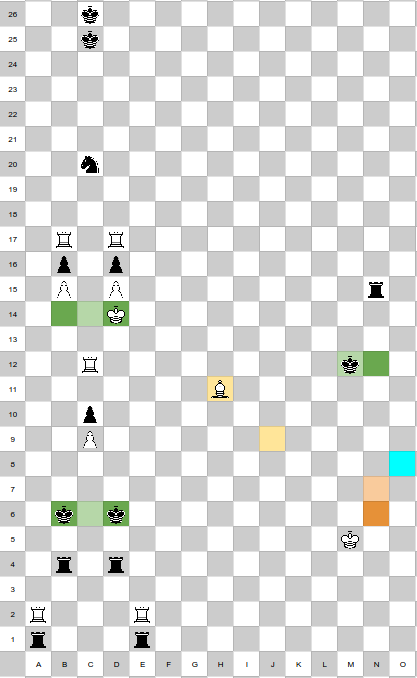

This is mainly adapted from [this](https://cp4space.hatsya.com/2013/04/03/circuitry-in-3d-chess/) series of posts, which outline much of the construction but leave some details unstated. 
I am just filling in the gaps.

Any 3d visualisations here that aren't minecraft are from that post. 

# Rules 
Rooks move any number of spaces in a single axis.
Kings move 1 space in any direction including triagonally 
White pawns move upwards (increasing z coordinate) and black pawns move downwards; pawns capture in diagonals that go in thair movement direction plus one space horizontally. (you could allow triagonals and it's probably possible though some setups would need to be altered)
Knights move 2 spaces in one axis and 1 space in another.
Bishops would move diagonally, i.e. along 2 axes. However i believe bishops are not needed in this setup. (you could also allow triagonal movements)
Queens aren't needed. 

[this](https://cp4space.hatsya.com/2013/03/30/three-dimensional-chess/) post has visualisations.

As stated in [the common definitions](/common-defs.md) page, capturing any king = win, and there's no castling, promotion, pawn doublemoves, en passant, or stalemate. (you could allow any of these things besides promotion to be possible in the ruleset but they won't come up) 

We are considering positions with only a finite number of pieces.

# Components 
Basic components mostly from [this](https://cp4space.hatsya.com/2013/04/03/circuitry-in-3d-chess/) post. 

## King cage: 
Traps 2 opposing kings.

## Rook cage: 
Most important component. Traps several rooks mutually pinning each other to trapped kings. 

Can be considered as two *virtual rooks*, ne of each colour, at the triple intersections of each line. 
They can deliver checks to kings, but not move otherwise. Unwanted lines of attack can be blocked by pawns. 

Importantly, virtual rooks are arbitrarily tileable (so you can have them covering several adjacent lines). There's a lot of flexibility in layout, the cages and physical rooks can be wherever needed to not get in the way of anything else.
They can also be *defended*, by defending the physical rooks part of them with a pawn (blocked by an opposing pawn) that leads to a discovered checkmate if it's allowed to capture. 
(Assume that any pawn that's defending some point anywhere in this setup is "strongly defending" it in this way - if it's allowed to capture, it wins)
We can typically assume any virtual rook to be strongly defended this way when relevant.

## Constrained rook
A virtual rook can pin an opposing rook to a king. Then the opposing rook can move freely within a column, but can't move outside of it. 
[TODO: visualisation]
We can ensure that only a few positions are useful for it to be in by using pawn walls to block unwanted attacks. from other positions.

A variant on the idea is to have two opposing rooks pinning each other and threatening to capture each other delivering a checkmate. They can then only safely stand on positions (strongly) defended by a pawn. 
I believe this variant isn't actually needed in the final construction. 

Bishops can also be constrained in the same ways. A virtual bishop is just a bishop pinned by a virtual rook, which can then constrain opposing bishops to a diagonal. 

## Corridors
Primary operation of the machine will be driven by white moving kings through corridoors to interact with components. 
Corridors constrain the king's movement to a single channel.
The original blog post contained physical corridors made of pawn walls, but virtual rooks can also constrain the king remotely in most cases, and are easier for me to visualise and think about. Physical corridors may be practical if you were trying to write a program to actually construct a full position from a given turing machine, but i'm a mathemetician i'm just proving existence here. 
[TODO: visualisation]

## Diodes and transistors
A transistor is a black rook along a coridoor that's able to be threatened by a king, and must move out of the way for it. (constrained along one axis of movement to do so). This frees up space in another corridor for another king to be able to move. 
It's a diode when this threat can only be made from one direction, preventing the king from moving backwards.
[TODO: visualisation]

Using diodes and transistors, it's possible to construct arbitrary logic gates like `and` and `or` gates, with corridors as wires to connect them. 

This can also store state - Say we have some black-box component with one entrance and several exits. 
We can have a "primary king" able to enter the component from one of several places, and along the way opens some transistors allowing auxilary kings to "remember" which state it came from. 
When the primary king exits the component, then a series of logic gates can be used to decide based on which exit it came from and where it started, where it should go next; and then "reset" to allow all the auxillary kings to travel back to their starting position.

## Counter - Overview
We aim to construct a *[Minsky machine](https://esolangs.org/wiki/Minsky_machine)* - a Turing Complete system consisting of 2 or more *counters*, and several *states*. 
In each state, we either increment a counter and go to a different state, or we decrement a counter, and go to one state if its zero and another state otherwise. 

With the back-box component above being a counter, with 2 entrances (increment and decrement) and 2 exits (increment complete OR decrememnt complete and non zero; and decremement complete and zero); the above process is exactly the logic needed to decide the operation of a Minsky machine. 

Within the counter itself, there wil be several sub-components that should be traversed in a particular order for an incrememnt or decrememnt operation, which the same idea can be used to manage, 

The counter is the most involved part of the construction. 

The principle is a "sliding king memory" - As described in [this](https://cp4space.hatsya.com/2013/04/05/3d-chess-is-turing-complete/) post, the back king will be constrained to a helix pattern. 

White then has a king on a ring below the helix, for which there white are virtual rooks attacking upwards, providing just one save space for the black king. 
During an increment operation, thw white king wil be able to move anticlockwise around the ring, forcing the back king to climb up the helix, and for decrements white moves clockwise. 

In the original blog post, there are knights constrained to a pair of columns, but the description they give is not something i was able to cleanly make work. There is also no description of the controlling ring. I aim to address these points. 

## Rook column
This setup allows a white rook to be constrained to a single column, but its height is unbounded. It is pinned to a white king, but the king can move upwards. 
a wall of pawns can move upwards with it to shield it from any rogue checks. 

A square of black virtual rooks below constrain the king to a column, with the central one providing the pin being (strongly defended)

## Helix 
Suppose for a moment we have a way to constrain the movement of a black knight, such that:
- It can only rest in one column 
- Its height modulo 4 cannot change

This is part of how we constrain black's king to a square helix pattern, as shown:

There are white rooks covering all the vertical columns outside of the helix.
Then, consider each cross-section of the edges of the helix. 

There's a line that's part of the helix where the black king is supposed to be allowed to occupy. White rooks in rook columns cover the rows above and below the helix arm, whereas a black knight occupies the row of the helix arm itself, defeding it from any possible rook attacks. 
(the original block post uses 4 rook columns er arm, but I think only 2 are needed)

As the knight is able to move in its column modulo 4, the pattern of possible allowed lines for this plane repeats every 4 rows. 
Putting 4 of these together at offset rows creates the full helix extending infinitely upwards.

At any given time, the white rooks and black knights only cover a finite subsection of the helix, where the king currently is or could be. 
During an increment or decrement operation, white will move their rooks and black will be given an oppotunity to move their knights to cover the new arms of the helix where the black king will be expected to end up when it climbs up or down.  

[TODO: visualisation]

## Strong virtual rook
A normal virtual rook cannot move and is only able to attack kings.
A *strong* virtual rook is a white rook that's able to make an actual *move*, to capture another piece. This will be used to defend columns we want to prevent the black knight from moving to. 
Once the white rook moves away from its defended spot, a black rook below will capture the white rook. 
It then however must return to its starting position, otherwise white will be able to force a checkmate. 

[TODO: image]

If white ever moves their rook for "no reason", then black can simply capture it for free and move back, and white is now at a strict disadvantage.
So white will only move the rook when it can actually capture something. 

The original blog post described this setup and claimed its enough to constrain black's knights to 2 columns.
However, I could not find a way to make this work. 
There are two issues - The first is that it's difficult to make this setup tilable, which is necassary to consttain several adjacent columns a knight might move to. 
The second is that if black recaptures white's rook (including after black intentionally sacrifices their knight to it) but doesn't move back, it still takes 3 turns for white to win (and in fact the original blog claimed to not need any bishops in the setup, for which the only forcing wins i could find take even longer) - and this allows an oppotunity for the rook to instead move around freely and chase down some king for a faster win. So you'd need to be very careful about sheilding everything in the position with pawn walls to ensure it's resilient to a few arbitrary rook moves.

Thus, I came up with an alternate setup for a knight column, inspired by a comment by `@Stage Cardinal` in the infinite chess discord.
The strong virtual rooks it uses have n tilability constraint and are set up in such a way that when white needs to capture a knight, a faster win than the one in the strong rook setup itself is being threatened, obligating the black rook to block it instead of returning to stop the slower win anyway.

## Knight column
This is a tricky part of the setup that needs to be carefully checked to ensure there are no adversarial moves that one side can use to gain an advantage they shouldn't. 

This image shows a cross section of the idea, not necessarily to scale:

In this image, all rooks are virtual, except for the white rooks above black rooks at the bottom, which are strong virtual rooks. 
Every king in a green region is confined to only that region using a series of virtual rooks elsewhere.

The basic idea is that during a part of the counter setup, a white king will need to move from m5 to o8 in order to make progress, for which it needs to go through n6 and n7. (anywhere else is covered by virtual rooks). To allow this, white's bishop must move from h11 to j9 (this bishop is constrained to its diagonal such that those are the only useful squares for it to be; by a pinning bishop not shown. This bishop can actually be a rook in three dimensions, but a bishop is easier to visualise in 2D). 
This forces black's king to block their rook that's constraining the n column, but will also remove its defense of c6, giving black an oppotunity to move a king there, opening a discovered attack on white's king and forcing it to c14.

The c column normally provides a pin from a white virtual rook of black's knight against a pair of black kings. The kings can move arbitrarily high upwards, and aren't threatened by white's arbitrary height rook columns as they can move faster than white can raise the ceiling of those columns, but they are constrained to the column by a ring of 8 white virtual rooks (2 of which are shown in this cross section at b17 and d17).

When white's king is forced to the c column, black has an oppotunity to move their knight. White then moves their king again to re-open the discovered check, forcing the knight to move back to its home column. (the fact that there are 2 kings rather then 1 at the top ensures black can't just move one out of the way above the knight's new position instead). 

If the knight had only moved out by 1 column, all is fine - it can return to either the same position it left, or up or down 4 spaces, which is fine.
However, if the knight had moved two columns over, it would be able to return only 2 columns higher or lower than where it started, breaking the modulo 4 constraint. Thus, we have strong virtual rooks covering the 4 bad columns (2 shown in this cross section) it could move to this way.
(if it moved 2 columns over but one column horizontally, i.e. toward/away from the viewer in this cross section, that's fine as it's only capable of returning to its original position)

When black moves their knight to a bad column this way, the resulting rook captures allow white to threaten a win using the column the knight normally defends - without a knight to defend it, the rook must move t this column instead, preventing it from moving to its home position and allowing the win enabled from the strong virtual rook setup. 
Care must be taken to ensure white's bishop can move back to cover c6 and prevent *black* from having a potential win if they were allowed to move arounf their kings to discover another check on white's king.
[This](./knight-column.md) appendix details the lines that are possible. 

One final detail is that the knight shouldn't be allowed to go too low, lest it start getting in the way of the rest of the setup. To accomplish this, there's a black rook in lowest row of the tower, such that if the knight goes too low as to block it, it enables white to cause a checkmate.

[TODO: 3d vis?]

So, overall, we have a system in which, whenever white wants to move a king through m5 to o8, it allows black an opportunity to move their knight upwards or downwards by 4 spaces, which is what we need for the helix constraint.

## Controlling ring
The final part of the counter is the controlling ring, which sits below the helix.

There are virtual rooks below every spot in the ring, and a white king on the ring that blocks one of them. The black king on the helix thus must remain above the white king.

The ring is 2 spaces tall besides a few bottlenecks for transistors, Normally, the white king is constrained to one position of the ring. 
Call the king on the ring A. 

[TODO visualisation]

During an increment operation, an external king B comes through. First it traverses each of the knight towers, allowing black an opptunity to move their knights to prepare for opening the parts of the helix necassary to climb for the increment. Then, transistor (1) is opened allowing A t move anticlockwise around the ring. When it reaches opposite its starting position, it opens transistor (2), enabling B to move to (3), and allowing A to traverse around the other half of the ring. Finally, it returns to its starting position openning transistor (4) (which is normally open) to allow B out.
Auxillary kings are used to keep track of internal state ensuring this all happens in the correct order. 
Decrementing is the same thing in a different order. 

## Zero test
At the bottom of the helix, the lowest position the black king will sit bis adjacent to a corridor that white wants to traverse, blocking access. It also blocks a black rook that normally prevents access to a different corridor. Thus which of these corridors white is able to traverse is a zero test. 

It is undefined behaviour for a minsky machine to decrement a counter below zero, and they can be constructed such that this will never happen.

## Conclusion
Putting all of this together, we have counters of that support operations of increment, decrement, and zero test, and can hold unbounded nonnegative integers. 
Attaching all of these to a system of circuitry for a state machine is a construction of a Minsky machine, which if it has 2 or more counters is Turinc Complete. 
We can model halting simply as a state where white has a forced win. 

Thus we satisfy our strong notion of Turing Completeness as defined in [the common definitions](/common-defs.md) page - for a Turing machine M, we construct a position and a strategy for white (just follow the steps of the computation), for which if M halts its a winning strategy that has an upper bound in the number of steps it takes to win, whereas if M doesn't halt theen there is no winning strategy. 
3D chess with finitely many pieces and multiple kings is Turing Complete. 

Bishops aren't needed in the setup (those in the strong virtual rook setup can be replaced for a longer forced win), so it's only the subset of kings, rooks, knights, and pawns that are needed. 

## Unresolved questions
I repeat the unanswered questions presented in the original blog post, with some of my own commentary

- Is 3D chess TC with different subsets of pieces? It may be possible to replace the knight towers with bishop towers.
- Is 3D chess TC when each side has only one king? 
- Is 2D chess TC? With finitely many pieces, I don't know. For regular positions that can repeat patterns infinitely in certain ways, I attempt a proof [here](/2d-reg-oneking/main.md). There ae some potential ideas for constructing a similar setup to this with finite pieces, in particular to create counters by constraining a black king to a zigzag pattern using bishops.
- Can anything be done with the notion of having infinitely many choices? This is used to construct "mate-in-omega" postions, where white has a win but not in any finite number of moves. In theory, this could be used to prove a stronger statement than turing completeness, namely that every statement in first-order Peano arithmetic can be encoded as a 3D chess position. The original blog conjectures that this is true, but is tricky. It easy to inject finite choices for either side into the state machine (white can choose to go down one of two paths, or black can choose t block white's access to one of two paths), allowing an *Alternating Turing Machine* to be constructed, but this doesn't translate to an infinite choice (say you can allow black to keep incrementing a counter until they chooe to stop. They could just never choose to stop, so this doesn't translate to "chosing an arbitrary integer"). 
But, say if black was able to move a rook arbitrarily far upwards at the start of the game. If white could get a rook above black's, pinning it, and somehow these rooks were prevented from capturing each other (say this is done twice and the rooks involved noe defend each other?), then white's rook could constrain the maximum height of a counter down to black's original choice. With the above mentioned finite black choice state they can increment this counter up to their original choice but not higher or else they lose. This would thus encode black choosing a true arbitrary natural number. 
However, sufficiently constraining this setup to not break the rest of the system and allow the rooks complete freedom seems tricky. 